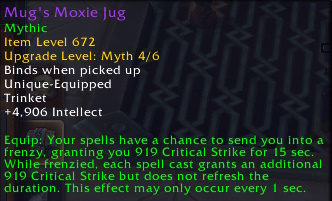

An indepth breakdown of all of the raid trinkets coming in Liberation of Undermine in Season 2 of The War Within.

<!-- truncate -->

import ITEM from "@site/src/components/ItemLink"

Raid trinkets continue to be the developers playground for testing out new ideas. Dungeon trinkets tend to be different kinds of either on-use or proc stat sticks which are powerful but rather boring in WoWs 20th year. In raid we instead get designs that make us wish they were a little more boring. There are a few topics to discuss before you scroll down the page to see which is best.

## Bugs

Almost every raid trinket (except <ITEM>Eye of Kezan</ITEM>) on the PTR is currently bugged and missing the ability to proc off HoTs or other periodic effects. The result is that almost every raid trinket is underperforming its expected uptime or HPS. For some specs this is as large as a 30% hit. I've sent in bug reports but am still waiting for this crucial fix. 

## How to Evaluate Trinkets

There are two trinket archetypes in modern WoW:
- Trinkets with passive intellect and a *small* effect. You expect these effects to do 2-3% of your healing. 
- Trinkets with passive secondary stats and a **large** effect. You expect these effects to do 5% of your healing.

When looking at how much something does on your meter you need to adjust your expectations for whether it was a small effect or a large one. If <ITEM>Gallagio Bottle Service</ITEM> does 4% of your healing and <ITEM>Mister Pick-me-up</ITEM> does 3% then that's a large win for the latter.

---

## Eye of Kezan

*Objective: Top Spymasters Web*

**Initial Rating: S**

**Chrome King Gallywix**

#### The Breakdown
- #### Numbers wise:
    - At 672 item level <ITEM>Eye of Kezan</ITEM> gives 448 intellect per stack, and you'll get a stack roughly every 12 seconds.
    - You need about 10 stacks for it to be equivalent to a regularly powered trinket so the trinket takes about two minutes to be decent.
    - At its max stack count it gives you an enormous ~9000 intellect. This dwarfs any other trinket option and makes it one of the most powerful in the game.
    - Even if you average the stack count you'll get over a fight you'll sit somewhere around 15 stacks which is huge.
    - The healing / damage proc you get while it's fully stacked is cute but not a significant portion of the trinkets power. Expect it to see it down the very bottom of your log. Don't let this bait you into thinking its not a strong trinket.

#### Verdict: Spectacular... in raid anyway

If you opted to stop reading the article, you'd at least know what your best in slot trinket is. It's good on every spec and despite some minor downsides is so far ahead on average value that you will feel more powerful the moment you equip it. Speaking of downsides there are two:
- The stacks disappear quickly when you're out of combat. That makes this is a harder sell in Mythic+ where downtime is common. It's not unusable - particularly in dungeons with little time spent running - but it's unlikely to be your best. 
- In raid, some fights are very front loaded. On Queen Ansurek or Fyrakk for example you had to put in your biggest healing shift in phase 1 when Eye of Kezan is at its weakest. Don't unequip it the moment a fight has damage on the pull but keep it in mind as we look at what Undermine has in store for us.

--- 

## Gallagio Bottle Service

*I feel bad rating what might actually be a role play trinket*

**Initial Rating: F**

**Dropped By: The One-Armed Bandit**

#### The Breakdown
- #### You should know:
    - <ITEM>Gallagio Bottle Service</ITEM> does require you channel for its 5 second duration.
    - The number of drinks you hand out is 10 x your haste percentage with every 10% haste adding one drink. It rounds *up* your drink count.
        - So 5% haste is 11 drinks, 18% haste is 12 drinks, 21% haste is 13 drinks and so on.
- #### Numbers wise:
    - With 12 drinks you're looking at around 8 million or so healing on a 1:30 cooldown. 90-100k HPS on average.
    - They also get about 14% speed. Very nice, thank you. 

#### Verdict: Forgot to add a zero
This is a very awkward trinket for them to nail the tuning on. It doesn't have intellect so like we covered above we're expecting a massive effect here. It also has a very long channel time which means it needs to do a lot more than others buttons you could press in that time instead. Unfortunately the times where this trinket is most valuable is also where you already want to be pressing your biggest buttons. A trinket that locks you out of doing that for a very long time needs to be almost absurdly overtuned to see any play whatsoever.

To double the size of the hit here, this trinket is not overtuned at all. In fact it does similar healing to Mr Pick-me-up which doesn't lock you out of your casts and also has a full intellect budget. Because the channel time is so long this is also a rare bad trinket that **I don't want them to buff**. I want to press my rotation during the most dangerous damage of the fight, I don't want to press a trinket instead. 

The only possible salvage in my opinion is to make the channel occur whether you are pressing spells or not (so basically a 5s buff instead of a 5s channel) but that's a striking change and the seasons release is nigh.

--- 

## House of Cards

*Spacey-free*

**Initial Rating: A**

**Dropped By: The One-Armed Bandit**

#### The Breakdown
- #### You should know:
    - <ITEM>House of Cards</ITEM> is mostly a fairly standard on-use stat trinket. It's not as RNG as it looks.
- #### Numbers wise:
    - Your first use of the fight will average 9307 mastery at max item level.
    - Your second use will average 9461, your third 9616 and so on. It's really not much of a difference.

#### Verdict: It's spec dependent but good

This is a well tuned on-use trinket but it's not good enough to leave off cooldown. Basically, if your spec is built around 90 second cooldowns then you'll love House of Cards. Examples include Preservation Evoker and Disc Priest. If your cooldowns are on a one minute or two minute cycle instead (basically the rest) then you'll avoid this if you can in favor of a trinket that lines up better with your cooldown cadence. 

--- 

## Mr Pick-me-up

*Call me, Mr Uppies*

**Initial Rating: A-**

**Dropped By: Sprocketmonger Lockenstock** *(yes that's a real boss, stop asking)*

#### The Breakdown
- #### You should know:
    - The healing beam prefers injured targets but isn't smart healing.
    - It doesn't interrupt whatever you're doing. It's just a buff that heals 5 people every 2 seconds for 6 seconds (so 15 people total).
- #### Numbers wise:
    - As a flat healing trinket <ITEM>Mister Pick-me-up</ITEM> is quite easy to evaluate. You can expect about 2-2.5 million healing per proc depending on your crit, versatility and overhealing.
    - The trinket is supposed to proc about 2.5 times per minute. So we're looking at 80-100k HPS if the proc bugs we discussed at the beginning of the article are fixed. In reality, it's doing about 30% less than that right now but most proc based trinket are afflicted by a similar issue.

#### Verdict: Surprisingly capable for a flat healing trinket.

Flat healing trinkets often have an issue where they do alright in normal and heroic content and then fall off as your healing scales up in Mythic. This will happen with Mr Pick-me-up too no doubt but it's at least tuned well enough that you'll be able to use it for a while. You're quite happy if you're getting 2.5-3% healing out of it which should happen quite commonly.

They've also wisely buffered against overhealing a bit by adding a damage portion if targets are overhealed. Don't expect this to do crazy DPS numbers but it's an appealing added bonus to a trinket that's already fairly good. Mr Pick-me-up is hit particularly hard by the proc rate bug so hopefully this is fixed before launch.

--- 

## Mug's Moxie Jug

**Initial Rating: A-**

**Dropped By: Mug'zee, Heads of Security**

#### The Breakdown
- #### You should know:
    - Most of the power is in the stacking buff you get while it's active. So if you don't cast many spells, then you aren't getting many stats. There's also a 1s internal cooldown to those hoping to cheat out stacks with off global cooldown spells are likely to leave disappointed. 

- #### Numbers wise:
    - If your spec presses buttons with any regularity (sorry Preservation) then it's quite easy to stack this up quickly. Even casting GCD-length spells with 20% haste will get you to 12 or so stacks + the free one you start with. That's an average of ~6000 crit per proc and you can expect a 30-40% uptime depending on bug fixes. Not bad.

#### Verdict: Average? Average is good
I honestly enjoy a trinket that pushes the "always be casting" creed by rewarding you further with extra stats. There isn't a ton to say on this trinket except that if you like crit and don't have 4 second casts in your kit then you'll probably like this. It's a particularly good fall back option if you don't have access to the S-tier trinkets like Eye of Rezan or if none of the other competitive trinkets like House of Cards fit your spec well.

---

## Reverb Radio

**Initial Rating: B+**

**Dropped By: Mug'zee, Heads of Security**

#### The Breakdown
- #### You should know:
    -  The trinket procs about 5 times a minute but won't proc while you have the "giga buff" active. That means you'll have the big "10 stack" buff about 20% of the time and somewhere between 0 and 4 stacks the rest of the time.

- #### Numbers wise:
    - You'll get a fairly big 3950 haste (6% haste) while the big proc is active. This won't necessarily be at a reliable time every pull so we'll assume we can't reliably line it up with cooldowns.
    - The smaller stacks will average about ~600 haste. To its credit you'll have a decent uptime on at least some form of power.

#### Verdict: It's below average but playable

You'd like more than the ~1300-1400 average haste this trinket gives but if you really like haste (Resto Druid) then you could still do worse - particularly as a fill in while you wait in line behind 16 other people for your <ITEM>Eye of Kezan</ITEM>.

