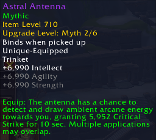

An indepth breakdown of all of the raid trinkets coming in Manaforge Omega in Season 3 of The War Within.

<!-- truncate -->

import ITEM from "@site/src/components/ItemLink"

The last few tiers we've had some very creative trinket ideas - particularly in raid which they often used as a testing ground for new ideas. In Manaforge Omega we've returned to fairly standard stat sticks with a few exceptions. There are a lot of non-trinket effect options this tier so they might have thought that complex trinkets on top of that would have been too much. In any case this should be a shorter read than usual because the trinkets are a lot more similar to one another. There's nothing here that's as bombastic as <ITEM>Eye of Kezan</ITEM>, <ITEM>Mister Pick-me-up</ITEM> or <ITEM>Mug's Moxie Jug</ITEM>. There are no real S-tier trinkets this tier. Just a bunch of well-tuned A-tier options.

## How to Evaluate Trinkets

There are two trinket archetypes in modern WoW:
- Trinkets with passive intellect and a *small* effect. You expect these effects to do 2-3% of your healing. 
- Trinkets with passive secondary stats and a **large** effect. You expect these effects to do 5% of your healing.

When looking at how much something does on your meter you need to adjust your expectations for whether it was a small effect or a large one. If <ITEM>Gallagio Bottle Service</ITEM> does 4% of your healing and <ITEM>Mister Pick-me-up</ITEM> does 3% then that's a large win for the latter.

---

## Astral Antenna

*Balls.*

**Initial Rating: A**

**Loomi'thar (Early boss)**

#### The Breakdown
- #### You should know:
    - When <ITEM>Astral Antenna</ITEM> procs it'll summon a small orb within 10 yards or so of yourself that'll slowly make its way to you. It takes 5 seconds to hit you if you aren't moving at all and you have 15 seconds in total to grab it before it despawns.
    - In general you should be able to treat this like a passive trinket, the only exception is when it spawns when you're about to make a significant movement across the room. You're also able to grab the orb early, or delay it briefly if you know you have a big burst of healing coming up.

- #### Numbers wise:
    - At 723 item level it'll average a whopping ~2.5k crit if you manage to grab every ball which should be realistic on most fights even if you don't try and grab them.
    - That number isn't high enough that specs that don't enjoy crit will seek this out (Resto Druid) but for everyone else this should be a powerful option.

#### Verdict: Above Average

You probably don't want to read huge passages of text about a fairly typical stat stick trinket so I'll just say that this is a solid option if you enjoy crit as a stat.

--- 

## Nexus-King's Command

*Pick your favorite friend and give them... a small shield... sometimes.*

**Initial Rating: B+**

**Dropped By: Nexus-King Salhaddar (Late boss)**

#### The Breakdown

*It does also give them a debuff so that you can track it on your frames.*

- #### You should know:
    - The absorb the target gets is based on the healing the trigger spell did. So if you Spiritbloom them for 1 million overhealing then they'll get a shield for that 1 million.
    - Similarly if the Regrowth you used to proc the buff didn't overheal them then they don't get anything. It's overhealing protection on your one spell cast.
    - You can delay consuming the debuff and you can even have more than one out at once (though the intellect buff wouldn't stack).
    - Debuffs are removed when you pull the boss but the 30 second timer is internal to the trinket so you'll get your first proc anywhere from 0-30 seconds in.

- #### Numbers wise:
    - The absorb portion of <ITEM>Nexus-King's Command</ITEM> isn't very high value outside of niche high Mythic+ scenarios where an absorb is much higher value than healing would be. 
    - You gain about 13% healing while the buff portion is active, though the edge over a standard passive intellect trinket is only 7.5%.
    - The trinket averages a poor 5.3k intellect but being able to store them and line them up with your healing windows has its own advantages.

#### Verdict: Not sure the juice is worth the squeeze
This isn't really what I expected out of a trinket that has an "Oath-Bound" theme. In reality your ally matters very little and it's really just a flexible stat proc trinket. Trinket theming does run secondary to the purpose of these trinket articles but I'm not sure if this trinket will quite match what people expect out of it. It reads like you'll be able to bind yourself to an ally for 10 seconds and this bond might greatly improve their survivability. Instead it's a mini-game where you try to *avoid* touching them until you need the intellect buff. If anything they might be *more* likely to die since you're not ready to ramp yet - surely another healer will help them out?

Power-wise the trinket is fine. In good hands it should be quite a capable trinket. For the rest of us though, I am not sure the micromanagement is quite worth the somewhat small reward.

--- 

## Loomithar's Living Silk

*The best Mythic+ trinket in the game. Raid drop.*

**Initial Rating: A**

**Dropped By: Loom'ithar (Early boss)**

#### The Breakdown

- #### You should know:
    - **Bug Watch:** <ITEM>Loomithar's Living Silk</ITEM> can currently apply to pets as one of its "four nearby allies". This makes it a lot weaker but a fix is likely so I'm writing with the assumption it will work as intended. I'm not sure Chops the Panther needs a 5m shield.
    - The shield the trinket applies is unique to each target. That means they get the 5.5 million on the tooltip each.
- #### Numbers wise:
    - The trinket absorb is equal to about a third of your health. That is multiple key levels worth of effective max health. Even if you are only able to get the Heroic version, it still provides a 4.2m shield.
    - The shield scales with your Versatility but not much else.

#### Verdict: It's a win

In raid I don't think it's worth giving up almost 8000 intellect for a shield effect on a medium cooldown though as far as these types of effects go it isn't awful. In Mythic+ this trinket should get an opportunity to really shine since eventually you'll run into a scenario where defensives are required to get through a damage check and you'll be able to include this in your defensive rotation. You'll also get multiple uses per boss and can pop it during dangerous trash to insure against missed interrupts.

--- 

## Diamantine Voidcore

*Higher proc rate when you're OOM. Finally a trinket designed for Restoration Shaman.*

**Initial Rating: A-**

**Dropped By: Fractillus (Mid Boss)**

#### The Breakdown
- #### You should know:
    - The mana bonus is not massive. Please do not burn your mana early for a slight increase in trinket procs. 
    - You'll average somewhere around 60% uptime. This will be important in a minute.
- #### Numbers wise:
    - <ITEM>Diamantine Voidcore</ITEM> is also part of a special effect set: Shards of the Void. If you wear it at the same time as one of the raid effect weapons then you'll massively buff the weapon effect while Voidcore is active.
    - By itself the trinket averages about 7.3k intellect. Slightly below average and fairly high variance compared to the passive intellect trinkets you could wear instead.

#### Verdict: Mandatory yet not that good

<ITEM>Diamantine Voidcore</ITEM> is good because the raid weapon set is good and making it 3x as strong 60% of the time is quite a good bonus. By itself you're looking at a fairly standard stat stick that has stronger contemporaries. That does make planning your gear this tier a little bit of a mess at the beginning - particularly when it comes to Vault selections.

--- 

## Araz's Ritual Forge

**Initial Rating: A-**

**Dropped By: Forgeweaver Araz (mid boss)**

#### The Breakdown

*Wowee*

- #### You should know:
    - The 15% maximum health cost is applied immediately as damage and you can heal it back up. You aren't down 15% health the entire duration. That does make it a rather pointless addition in my opinion. I love risk / reward trinkets but the risk here is very low. 
    - <ITEM>Araz's Ritual Forge</ITEM> diminishes at a linear rate so half way through the duration you'll have lost half the buff size and so on.

- #### Numbers wise:
    - During the apex of the buff it gives you a whopping 30%+ healing increase.
    - It falls behind the value of a regular trinket with a little less than a quarter of its duration left. You're also down about 5% healing when the trinket isn't active.

#### Verdict: Niche, but it's a common one
Realistically I can't rate such a significant burst of healing too low because there have been many bosses where improving your healing in a few specific windows are your only real objective to killing the boss. I'm not sure I'd wear it on every fight though, and if you are progressing a little later in the tier you might find a more sustained healing bonus to be more valuable for you. Any specs that won't align well with two minute cooldowns will also want to pass. Some specs might also find the 1.5 minute cooldown <ITEM>Lily of the Eternal Weave</ITEM> to be more useful - it's also less all-in on the on-use so your healing won't have such a large variance between in and out of cooldowns.

---

[If you enjoy QE content like this trinket preview, or if QE Live has helped you over the years, consider the Questionably Epic Patreon. Contributions from the community have made the last eight years of content possible. ](https://www.patreon.com/questionablyepic)

