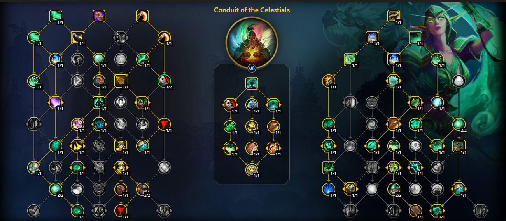
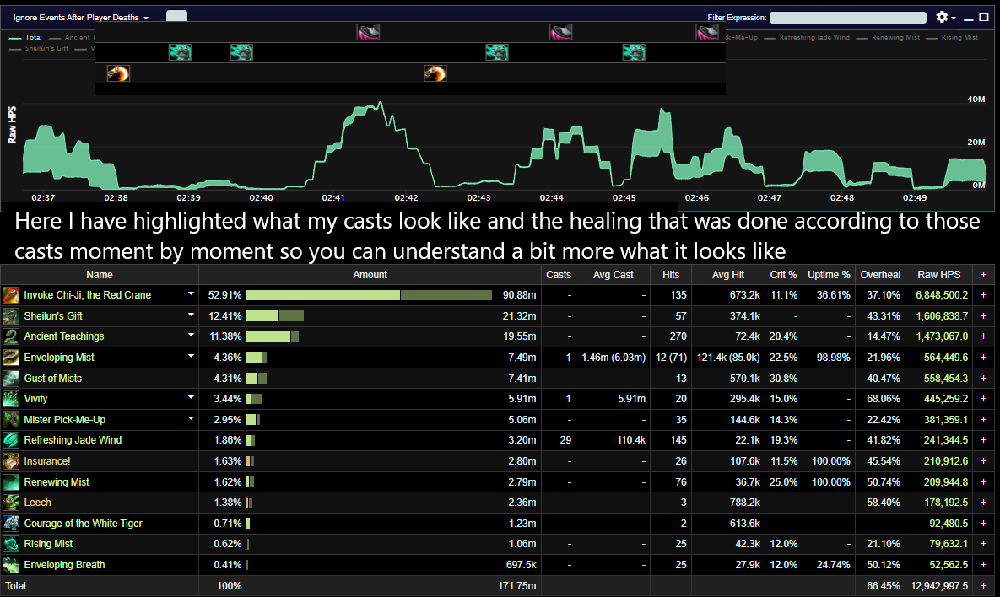
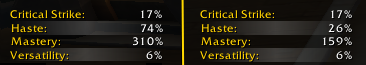

<WH>Chi-ji</WH> is an alternative build that's seeing quite a bit of play right now. It shouldn't be played 100% of the time and Yu'lon is still very competitive. Yu'lon can have a higher max throughput depending on the fight. This page is a comprehensive rundown on how to play <WH>Chi-ji</WH>, on which fights it's strong, and what your stats and gearing will look like. I actually think this build is harder to play due to its reliance on melee range. If you're brand new to Mistweaver I'd recommend sticking with Yu'lon unless you really enjoy this more.

## The Build

**Build Link:** C4QACdq2zyOHcHaPcZ/HhhelgDAAAAAAAADbMzyYWMbzYGLYz2sNzgZbZbmZZhZmmZmBmhZAsNjZY2YmBLPwEAAAAgZZab2mZZWsMLbz2MzEEAYD

## Talent Choices

#### Jadefire Teachings

<WH>Jadefire Teachings</WH> provides a significant amount of our overall HPS in the build and you should play around it as much as possible. The easiest way to play around <WH>Jadefire Teachings</WH> is to grab <WH>Jade Empowerment</WH> and use Crackling Jade Lightning. If you pair <WH>Jade Empowerment</WH> with Secret Infusion windows you can generate a ton of healing. <WH>Jade Empowerment</WH> is also exceptionally strong when cleaving off adds but we'll cover that in more detail later.

#### Resplendent Mists?

Resplendent Mists might seem like a good fit for a <WH>Chi-ji</WH> build and you might be surprised that we don't take it. The simple answer is that <WH>Chi-ji</WH> already does a ton of HPS inside its window and Resplendent Mists loses a lot of value to overhealing. It's also up against strong alternatives like Shaohao's Lessons.

#### Dancing Mists vs Refreshing Jade Wind vs Life Cocoon Talents 

These talents are basically just personal preference. Refreshing Jade Wind is the most HPS, Mist Wrap provides stronger <WH>Black Ox</WH> uses, Calming Coalescence is good for saving lives with <WH>Life Cocoon</WH>. Try them out and see which you prefer for a given fight.

## Rotation

The <WH>Chi-ji</WH> raid build plays similarly to how you might in Mythic+. The only major differences is you're playing with <WH>Jade Bond</WH> and you have the <WH>Celestial Conduit</WH> hero tree which you'll need to play around a bit more. You still want to apply <WH>Renewing Mist</WH> to targets when out of <WH>Chi-ji</WH> and you still want to press <WH>Vivify</WH> when it makes sense to but some of your other abilities take on a higher priority so let's look at those:

#### Short Cooldowns or Baseline Abilities

- <WH>Rising Sun Kick</WH>: Similarly to how you'd cast <WH>Rushing Wind Kick</WH> off cooldown as a Yu'lon build, this is how you'll use <WH>Rising Sun Kick</WH> as well. The only difference between the two is you're not penalized for back to back casts like you would be with <WH>Rushing Wind Kick</WH> (due to overlapping the buff).
- <WH>Blackout Kick</WH>: Especially important during <WH>Chi-ji</WH> windows as the bulk of your HPS will come from <WH>Blackout Kick</WH>s. Also used a lot throughout your rotation and it's common for it to be your most cast ability. Expect 8-13 CPM.
- <WH>Tiger Palm</WH>: Cast whenever <WH>Blackout Kick</WH> and <WH>Rising Sun Kick</WH> are on cooldown and you have no immediate need for other abilities. Keep in mind you can 2 stacks of Teachings of the Monastery per cast so the likelihood of resetting the cooldown on your <WH>Rising Sun Kick</WH> is high.
- <WH>Jade Empowerment</WH> / Crackling Jade Lightning: Makes up the majority of your healing outside of <WH>Chi-ji</WH> windows. You'll want to play around it. If you can pair it with Secret Infusion, Shaohao's Lessons or any other amplifier then it's worth doing that. For a fight like Gallywix you can save two charges to bring into add spawns in phases 2 and 3 and gain a lot of HPS by cleaving your Crackling Jade Lightning to adds. Avoid overcapping on charges.
- <WH>Jadefire Stomp</WH>: Stand in <WH>Jadefire Stomp</WH> as often as possible. It'll help you reset its cooldown and it'll keep the Awakened Jadefire buff up. It actually does quite a lot of HPS on its own if you have a good amount of mastery so aim it well and use it when people are damaged if you can. In any case make sure your <WH>Jadefire Teachings</WH> uptime is as high as possible.
- <WH>Renewing Mist</WH>: Press <WH>Renewing Mist</WH> whenever it makes sense due to our tier set. Avoid csating it during <WH>Chi-ji</WH> unless you're pairing it with <WH>Thunder Focus Tea</WH>.
- <WH>Vivify</WH>: Due to the free <WH>Vivify</WH> procs we get every 10s, we'll want to slot in <WH>Vivify</WH> casts whenever it makes sense. They hit quite high on average since the low <WH>Renewing Mist</WH> count we have as <WH>Chi-ji</WH> increases each <WH>Vivify</WH> hit (due to square root scaling). 
- <WH>Zen Pulse</WH>: This is technically more of a proc than an ability but it's quite important so we'll cover it as if it is one. Since this build casts <WH>Vivify</WH> less you can hold onto <WH>Zen Pulse</WH> procs and use them in response to dangerous raidwide damage. Your <WH>Thunder Focus Tea</WH> can also be used to carry a natural proc of <WH>Zen Pulse</WH> into a damage window more easily. Make sure you don't waste too many procs.

#### Longer Cooldowns

- <WH>Thunder Focus Tea</WH>: Can be used on a number of spells but generally follows the same priority as the Yu'lon build. 
    - Use it on <WH>Renewing Mist</WH> before or during <WH>Chi-ji</WH> because the multiplicative haste buff it gives you is very strong.
    - Use it on <WH>Rising Sun Kick</WH> outside of <WH>Chi-ji</WH>.
    - Situationally use it on <WH>Renewing Mist</WH> or <WH>Enveloping Mist</WH> outside of <WH>Chi-ji</WH> depending on the situation and incoming damage.
- <WH>Celestial Conduit</WH>: You want to use <WH>Celestial Conduit</WH> as a tool to help you ramp <WH>Renewing Mist</WH>s into a period where you can get good value from your <WH>Zen Pulse</WH>. Avoid holding onto <WH>Celestial Conduit</WH> for too long. Use it early and often. Let's say you have a natural <WH>Zen Pulse</WH> proc and think you can get value from <WH>Celestial Conduit</WH> and refresh that <WH>Zen Pulse</WH> proc with the cooldown reduction on <WH>Thunder Focus Tea</WH> (via <WH>Heart of the Jade Serpent</WH>), you'd want to:
    - Use <WH>Renewing Mist</WH> charges and press <WH>Rising Sun Kick</WH> on cooldown.
    - Back to back <WH>Zen Pulse</WH> Vivifies to maximize that healing window.
- <WH>Sheilun's Gift</WH>: Use <WH>Sheilun's Gift</WH> before your Celestial or any other big HPS windows such as a <WH>Celestial Conduit</WH> ramp or <WH>Revival</WH> / <WH>Restoral</WH> since the Shaohao's Lesson buff is big.

#### ...Enveloping Mist
This one is difficult to explain so re-read this a few times if you need. 

- Outside of <WH>Chi-ji</WH>: Use <WH>Enveloping Mist</WH> the same way you would in a Yu'lon build. Whenever you get a <WH>Strength of the <WH>Black Ox</WH></WH> proc use it on whoever you think is the best fit.
- During <WH>Chi-ji</WH>: With <WH>Chi-ji</WH> active you'll get instant cast <WH>Enveloping Mist</WH> and you'll have to choose between casting it and spamming more DPS abillities for <WH>Gust of Mists</WH> procs. This decision depends a bit on what damage the raid has currently taken but as a general rule:
    - If you have more than 280% mastery -> Just skip <WH>Enveloping Mist</WH>.
    - If not -> Cast <WH>Enveloping Mist</WH> if there is a lull in raid damage taken only.

## Sequencing Your Chi-ji Window

Make sure you have four stacks of Teachings of the Monastery before you press <WH>Chi-ji</WH> so that your first <WH>Blackout Kick</WH> will do a lot of healing. <WH>Chi-ji</WH> healing is extremely front-loaded as you can see in this log below:

You'll do the majority of your <WH>Chi-ji</WH> healing in the first 12 seconds of its duration due to <WH>Chi Cocoon</WH>s and your prepared four stack <WH>Blackout Kick</WH> opening your sequence. Study the cast timeline in the image above. Note a few important things:
- <WH>Tiger Palm</WH> is cast to setup <WH>Blackout Kick</WH> and <WH>Blackout Kick</WH> is pressed immediately as raid damage ticks. 
- <WH>Rising Sun Kick</WH> is used off cooldown and is a significant portion of your healing.
- <WH>Blackout Kick</WH> provides 6+ <WH>Gust of Mists</WH> heals per kick! Make sure you're not casting these when the raid is topped or you'll miss out on a lot of healing.
- <WH>Enveloping Mist</WH> is a potential cast. See the <WH>Enveloping Mist</WH> section above.

## When do I play this build?

<WH>Chi-ji</WH> is good in a lot of fights this raid but it's not your de facto choice. If a fight has healing absorbs, extremely large damage windows that last between 15 and 20 seconds, add phases, or high movement requirements then <WH>Chi-ji</WH> should fit very well. A few specific examples:

#### Stix Bunkjunker

A good fight for <WH>Chi-ji</WH> and a good fight for <WH>Jadefire Teachings</WH>. You have to be a bit smart here and I'd recommend tracking the timers for <WH>Jade Empowerment</WH> and using them whenever the Prototype Powercoils are on players (preferably toward the later end of the stacks, so 5+). That way you can easily cleave healing to them and keep them alive. With all the adds on this fight Jade Empwoerment gets ridiculous value and you'll do serious HPS. 

#### Sprocketmonger Lockenstock

Setup Teachings of the Monastery stacks between mine hits and burst the raid back to full.

#### One-Armed Bandit

Adds overlap with high damage taken periods which means you can use <WH>Jade Empowerment</WH> to cleave a lot of damage and healing onto the raid. <WH>Chi-ji</WH> is also a great counter to the fights healing absorbs.

#### Chrome King Gallywix

The best fight for <WH>Chi-ji</WH> in the entire raid. Has both healing absorb windows and add phases that overlap with heavy raid damage. Wonderful.

## Gearing & Stats

Mastery is better for <WH>Chi-ji</WH> than Yu'lon but not to as big an extreme as you might think. **You're not required to have a specific mastery percentage to play this build. If you don't have a mastery set just throw on some rings or a neck if available.** You want a little mastery here, not a lot.

Here you can see my stats pre and during <WH>Chi-ji</WH>. I'm playing House of Cards here and you can see the impact of multiplicative haste increases like <WH>Invoker's Delight</WH>. Mastery is good at scaling the healing you do inside the <WH>Chi-ji</WH> window but weak outside of it. That leads to a preference for Haste instead. After haste and a little mastery you can stack crit and versatility equally. They're both similarly good. 

Grabbing an on-use trinket like Signet of the Priory or House of Cards is a very good way to get more healing out of your burst windows and I'd recommend them. If you do have House of Cards then you'll need less natural mastery on your gear. QE Live will have support for the build next week.

## Final Notes

This build is overtuned in a bit of a stupid way. I'm a fan of <WH>Chi-ji</WH> and I like the changes overall but <WH>Jade Empowerment</WH> is very overtuned and breaks the build. The world first guilds often played two Mistweavers on most fights and has one play Yu'lon and the other <WH>Chi-ji</WH>. If you're the only Mistweaver in your guild then just play whichever you think will be best for progression on a given fight.

