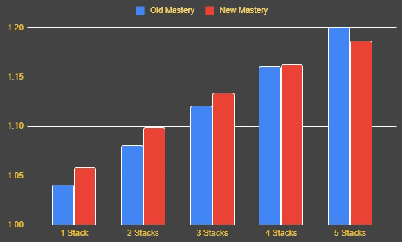

# What's changing going into 11.1

In patch 11.1, Resto Druid receives a brand new Class Tree. It's amazing but more on that in a minute. We also got a mini-mastery revamp that we're going to cover in detail so it doesn't get misunderstood, and Tranquility got a long awaited buff. 

### Class Tree Changes

I'd highly recommend bringing up the new class tree on wowhead and just seeing what you can put together. What you'll realize very quickly is that you can take absolutely everything you want which is a stark change from the old class tree. Here are some highlights:
- Moonkin Form returns. You won't necessarily use it much, but if you're in dire need of a good Flap then it's not too difficult to path to. In Mythic+ Catweaving remains the dominant way to DPS so while you can play a ranged playstyle if you like, you're unlikely to find it featured in many guides. The Moonkin version of Wild Charge is also useful on some fights. It's a disengage, so it flies you backwards when you press it.
- New Talent: Lycara's Meditation. Swapping in or out of a form lets you keep the stat your previous form for 5 seconds. A few notes on this one:
    - It doesn't apply to caster forms Haste bonus which is still lose the moment you shift to a form.
    - If you swap to Cat Form via an instant Skull Bash (with Fluid Form) then you need to remain in Cat Form for 2 seconds before you swap out to keep the crit bonus. This was added to counter a rather ridiculous play pattern where you'd spam Skull Bash on cooldown for stats.
- New talent: Symbiotic Relationship. This is like a mini-beacon which lets you share your significant self-healing with a target of your choice. I recommend getting a [weak aura](https://wago.io/qGDJdVRrk) to track whether you have it active or not.

### New Old Mastery

From Legion to patch 11.0 our mastery was a flat multiplier depending on the number of mastery "stacks" (or HoTs) you had active on the target. If you had 20% mastery and 4 HoTs then you'd do 80% more healing to that target. In 11.1 each stack will offer less value than the previous one, but will still add more healing. **I want to make it very clear that adding a mastery stack is never a healing loss.**

> TL;DR: Mastery is stronger now when you have four or fewer HoTs out. It's weaker than before above that.

### Other Stuff
- Tranquility cast time reduced to 5 seconds (from 8). A great quality of life change that's particularly impactful in Mythic+ where Tranquility was previously not worth the point.
- Flourish now has a flat heal component when you press it. It's alright. 

## 11.1 Tier Set

- 2pc: Your heals have a chance to apply Insurance! to their targets that heals them over 15 sec. If the target drops below 40% health the HoT is consumed and the target is healed immediately.
- 4pc: When Insurance! is consumed or removed, it leaves a missing Rejuvenation, Regrowth, or Wild Growth with a 15s duration on its target. Lifebloom's bloom portion has a 30% chance to apply Insurance! to its target for 10 sec. 

These are actually quite good bonuses - particularly our new 4pc. You can expect 6-7 free HoTs every minute from the combined set which has a few flow on effects like higher Abundance uptime and better mastery value. 

## Season 2 Trinkets

## Do I still have to wear Cyrces Circlet?

Yeah at current tuning you'll wear Cyrces Circlet all season. Expect a nerf to hit in the 11.1.5 patch. 
