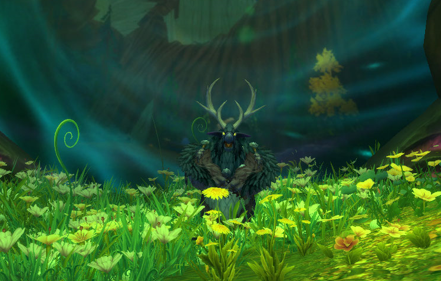

import ITEM from "../src/components/ItemLink"

# What's changing going into 12.0.5

Resto Druid got the following changes in patch 12.0.5:
- <WH>Everbloom2</WH> (Ranks 2 & 3) buffed – When <WH>Lifebloom</WH>'s final bloom occurs *(was all <WH>Lifebloom</WH> healing)*, it heals 6 allies *(up from 2)* within 40 yards for 25%/50% of its healing amount *(was 15/30%)*.
- <WH>Everbloom3</WH> (Rank 4) now triggers <WH>Lifebloom</WH>s "final bloom" 3 times *(was 5)*.
- All caster DPS spells buffed significantly.

A "final bloom" is the burst healing portion of <WH>Lifebloom</WH> that happens when it expires, when you refresh with less than 4.5 seconds left, or when talents like <WH>Photosynthesis</WH> and the fourth rank of our Apex proc. 

# Is this a buff or a nerf? Do we use Apex in raid now?

Previously, our Apex talent (<WH>Everbloom1</WH>) was very strong in Mythic+ but fairly poor in raid which led to many people dropping the talent entirely. The 12.0.5 buffs are aimed at rectifying this problem and they've picked such high numbers that it's now a lock-in for all content. You will even pick some talents that synergize well with the Apex like <WH>Photosynthesis</WH>. You should feel significantly more powerful in raid than before.

# Should we change Hero Trees? Why?

We'll be swapping to Wildstalker in all content. Wildstalker synergizes very well with the Apex talent buff since you can use the <WH>Implant</WH> hero talent to guarantee high <WH>Symbiotic Bloom</WH>s uptime on your <WH>Lifebloom</WH> target. This is a 30%++ increase to our Apex healing since that healing increase also buffs the splash healing it does. **Remember, you do not need to go into <WH>Cat Form</WH> as Wildstalker. Your healing and DPS do not interact with each other.**

[You can find the latest build here](https://www.wowhead.com/guide/classes/druid/restoration/talent-builds-pve-healer)

# Are we still Catweaving in Mythic+?

*Moonkin pictured for demonstration only. Moonkin Form not actually that good.*

You mostly won't Catweave anymore. You will DPS in caster form instead. A basic form of the rotation can be found below:
- **Single Target**: Keep <WH>Moonfire</WH> active. Cast <WH>Starsurge</WH> on cooldown. Cast <WH>Wrath</WH>.
- **AoE:** Cast <WH>Starfire</WH>. <WH>Sunfire</WH> is worse DPS, but can be cast on the move.
- **<WH>Heart of the Wild</WH>:** Swap to <WH>Cat Form</WH>. Cast <WH>Heart of the Wild</WH> (Feral Frenzy). Cast <WH>Ferocious Bite</WH>.

We will take <WH>Moonkin Form</WH> for pathing, but won't really use it for DPS. It's a minor (3.5%) DPS gain, but costs us either a GCD or a tier 3 class talent (to take <WH>Fluid Form</WH>). 

### Wouldn't this make Keeper of the Grove better?

We mostly pick our hero tree based on which heals for more - which is still Wildstalker. However, Keeper of the Grove does have a niche as the higher *DPS* tree now so that's an option for either weekly keys you trivially outskill, or high keys that you're comfortable with the healing check on. 

# Quickfire Questions
- **If I upgrade a Hero-track item with the new Ascension system, does it go to 298 item level?** No, Hero track items go to 285 item level, crafts go to 295, Myth-track to 298.
- **What is the best dungeon or raid boss to spend my bonus roll tokens?** This depends heavily on your gear, but Crown of the Cosmos Mythic, Chimaerus Mythic or Nexus-Point Xenas (Mythic +10) are your best generic bets. You're basically just aiming to get items that are hard to get like rare trinkets, or a Myth-track weapon.
- **Are we overpowered now?** Perhaps.
- **Should I be letting <WH>Lifebloom</WH> fall off?** Definitely not.
- **Are there any major playstyle changes?** <WH>Lifebloom</WH> uptime becomes extremely crucial. Make sure your <WH>Lifebloom</WH> target also has two <WH>Rejuvenation</WH> buffs and a <WH>Regrowth</WH> and <WH>Swiftmend</WH> them off cooldown. Check your <WH>Lifebloom</WH> uptime with [WowAnalyzer](https://wowanalyzer.com/) after every pull until you are sitting at 95%+ uptime.