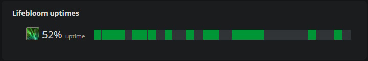

import ReactPlayer from 'react-player'

# Common Mistakes & How to Log Review

While having someone look over your log is a great way to improve, learning a few key metrics to look out for can enable you to review your own log - even between pulls. I'd recommend picking one of the below that you're not doing well and focus entirely on improving it for a few pulls. Once you're satisfied with it, add a second bullet point. Trying to improve every metric at once can be less effective than doing them one at a time until they are engrained in your gameplay.

If you are new to Warcraft Logs then there is a starter guide [here.](https://www.warcraftlogs.com/help/start)

### The Warcraft Logs Casts Tab

The Warcraft Logs casts tab can tell us a ton about our gameplay. 

- Total CPM (casts per minute) minus <WH>Germination</WH> (fake casts) should be around 50. **By far the most common error we see are players who just do not cast enough spells.**
- <WH>Swiftmend</WH> with <WH>Verdant Infusion</WH> should be around 4.5 CPM and be used mainly on the same target as <WH>Lifebloom</WH> to extend it, along with Rejuv and <WH>Germination</WH>.
- <WH>Swiftmend</WH> with <WH>Prosperity</WH> should be around 6 CPM. **Swiftmend is very important in Midnight.**
- <WH>Lifebloom</WH> uptime should be 100%. If this is a persistent issue for you, then consider changing your user interface to better highlight when Lifebloom is missing. 
- <WH>Wild Growth</WH> should also be used often, especially while <WH>Incarnation: <WH>Tree of Life</WH></WH> is active. Not necessarily on cooldown, that can be rough during movement and for mana, but at least ~4 CPM is a good number.
- Your cooldowns should be used very regularly. Convoke every 1:00, Incarnation every ~1:30, <WH>Tranquility</WH> and <WH>Innervate</WH> every 3 mins (not at the same time).
- Damage spells should only be used for mana recovery via <WH>Master Shapeshifter</WH> if necessary.

### Casts Timeline

- Are you cycling between ramping Rejuvs -> spamming <WH>Regrowth</WH>?
- <WH>Rejuvenation</WH> ramp with <WH>Swiftmend</WH> (<WH>Soul of the Forest</WH>) being used to spread Rejuv.

- <WH>Regrowth</WH> spam after ramping, playing around <WH>Abundance</WH> to 100% Crit. This will last until your <WH>Abundance</WH> starts dropping past 8-7 stacks. <WH>Swiftmend</WH> and SOTF on Rejuv will extend this window. **Do not neglect your <WH>Regrowth</WH> casts.**

Your gameplay should be alternating between these 2 modes throughout the fight.

### Spell queueing around Swiftmend:

<WH>Swiftmend</WH>, when spell queued after a hard cast, will "calculate" the effects before the hard cast finishes. This has 2 side effects:
- It can consume a Rejuv because the game didn't register that you'll have another HOT up on that target at the end of your current cast.
- It can use SOTF on the <WH>Regrowth</WH> that you were casting before <WH>Swiftmend</WH> because the game will register your instant cast at the same time and immediately spend it already.

Avoid this:

### WoWAnalyzer
[WoWAnalyzer](https://wowanalyzer.com/) is a log analysis site that you can use to help improve your play. It's 100% free!

- Double check <WH>Lifebloom</WH> uptime and effective <WH>Efflorescence</WH>. If it's too low (like under 80%) you might want to start maintaining <WH>Lifebloom</WH> on yourself (and position in the stack) or on a melee DPS.

- <WH>Swiftmend</WH> casts - if playing VI, most of these should be blue, extending <WH>Lifebloom</WH> and Rejuv (and <WH>Germination</WH>) on the target.
- With <WH>Prosperity</WH>, <WH>Swiftmend</WH> casts should mostly be Green and Yellow. Red is not good, but better to have some Red and high cast efficiency (95%+).
- <WH>Soul of the Forest</WH> - should be all on Rejuv unless it's necessary to <WH>Regrowth</WH> for triage / spothealing on a critically low target.
- Cooldowns - check that they are all used with <WH>Wild Growth</WH> and a proper Rejuv ramp up.

### Watch Commentary Videos

It can be very useful to watch commentary videos to watch experienced players put into practice Resto Druid fundamentals. Here's one from Phased:

  <ReactPlayer 
    url="https://youtu.be/YcZsfIKv-XY" 
    controls 
    style={{ paddingRight: "12px" }} 
    width="100%"
    height="100%"
  />

*Written by Face2face.*