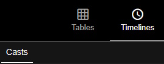
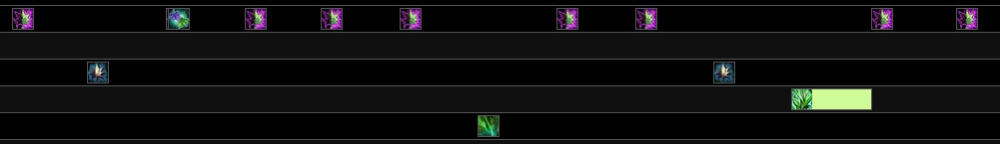
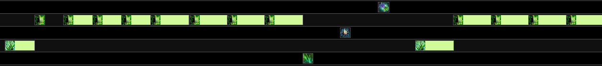
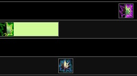
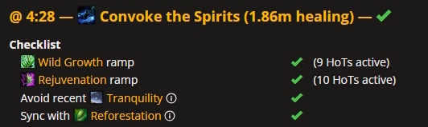

# Reviewing your own logs

While having someone look over your log is a great way to improve, learning a few key metrics to look out for can enable you to review your own log - even between pulls. I'd recommend picking one of the below that you're not doing well and focus entirely on improving it for a few pulls. Once you're satisfied with it, add a second bullet point. Trying to improve every metric at once can be less effective than doing them one at a time until they are engrained in your gameplay.

If you are new to Warcraft Logs then there is a starter guide [here.](https://www.warcraftlogs.com/help/start)

### The Warcraft Logs Casts Tab

The Warcraft Logs casts tab can tell us a ton about our gameplay. 

- Total CPM (casts per minute) minus Germination (fake casts) should be around 50. **By far the most common error we see are players who just do not cast enough spells.**
- Swiftmend with Verdant Infusion should be around 4.5 CPM and be used mainly on the same target as Lifebloom to extend it, along with Rejuv and Germination.
- Swiftmend with Prosperity should be around 6 CPM.
- Lifebloom uptime should be 100%. 
- Wild Growth should also be used often, especially while Incarnation: Tree of Life is active. Not necessarily on cooldown, that can be rough during movement and for mana, but at least ~4 CPM is a good number.
- Your cooldowns should be used very regularly. Convoke every 1:00, Incarnation every ~1:30, Tranquility and Innervate every 3 mins (not at the same time).
- Damage spells should only be used for mana recovery via Master Shapeshifter if necessary.

### Casts Timeline

- Are you cycling between ramping Rejuvs -> spamming Regrowth?
- Rejuvenation ramp with Swiftmend (Soul of the Forest) being used to spread Rejuv.

- Regrowth spam after ramping, playing around Abundance to 100% Crit. This will last until your Abundance starts dropping past 8-7 stacks. Swiftmend and SOTF on Rejuv will extend this window. **Do not neglect your Regrowth casts.**

Your gameplay should be alternating between these 2 modes throughout the fight.

### Spell queueing around Swiftmend:

Swiftmend, when spell queued after a hard cast, will "calculate" the effects before the hard cast finishes. This has 2 side effects:
- It can consume a Rejuv because the game didn't register that you'll have another HOT up on that target at the end of your current cast.
- It can use SOTF on the Regrowth that you were casting before Swiftmend because the game will register your instant cast at the same time and immediately spend it already.

Avoid this:

### WoWAnalyzer
[WoWAnalyzer](https://wowanalyzer.com/) is a log analysis site that you can use to help improve your play. It's 100% free!

- Double check Lifebloom uptime and effective Efflorescence. If it's too low (like under 80%) you might want to start maintaining Lifebloom on yourself (and position in the stack) or on a melee DPS.
- Swiftmend casts - if playing VI, most of these should be blue, extending Lifebloom and Rejuv (and Germination) on the target.
- With Prosperity, Swiftmend casts should mostly be Green and Yellow. Red is not good, but better to have some Red and high cast efficiency (95%+).
- Soul of the Forest - should be all on Rejuv unless it's necessary to Regrowth for triage / spothealing on a critically low target.
- Cooldowns - check that they are all used with Wild Growth and a proper Rejuv ramp up.

*Written by Face2face.*