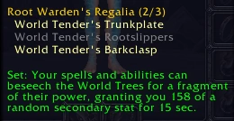
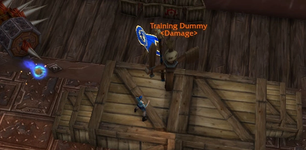

import ITEM from "../../components/ItemLink" 

# Midnight Embellishment Preview: Part II

Today we'll look at the other half of the embellishment effects. Between the two articles we'll have covered about 95% of the ones available. The remaining 5% are pure DPS embellishments. They could be useful in some niche cases like ultra high Mythic+ but we'll come back to those a bit later.

## The Difficulty with Sets

You'll notice that most of the embellishments in todays article are parts of sets where you need two pieces to activate the bonus. That introduces two problems:
- Cannot be put on weapons so if you craft a 2-handed weapon first you won't be able to craft the set for weeks.
- One piece of the bonus will use a spark but offer no bonus. So you're delaying your power boost longer. 
They can still be very good, but if they remain good expect not to see them until a little bit later in the season.

 

## Root Warden's Regalia
***Set Pieces:*** Chest, Waist, Feet  
***Armor Type:*** Mail Only  

<WH>Root Warden's Regalia</WH> is a mail-set that offers a standard random secondary proc. The stat buffs can overlap which means you'll lose less value to getting a proc while
you already have one (we usually call this "proc munching"). You'll average a high ~120 secondary stats which is higher than anything except Darkmoon Sigil: Hunt (which is bugged). The only condition is you really need all four secondary stats to be good for your spec. Preservation Evoker will be, Resto Shaman might not. It's also a set so is susceptible to the set weaknesses outlined above. 

**Rating: A+**

 

## Murder Row Materials
***Set Pieces:***  Chest, Hands, Wrist  
***Armor Type:***  Leather Only  

The Leather set, <WH>Murder Row Materials</WH> appears the most ambitious on paper with a variety of effects possible every 30 seconds. Unfortunately, it does not proc at all off healing crits and most damage crits will just proc one of the two DPS effects. In testing I was not able to proc the healing effect at all so hypothetically the set is intended to work with healing crits and just doesn't right now, however, I'm not sure why you'd ever pick a healing effect that can proc every 30s and will sometimes be wasted on DPS procs over any other embellishment. 

The animations also didn't match the tomfoolery the tooltip suggested I might get, and I got the AoE damage proc often - even on single target enemies. I think this one is a hard skip for now and it'll be getting my lowest rating.

**Rating: F**

 

## Sunfire Silk Trappings & Arcanoweave Trappings
***Both Sets:***   Bracers, Boots, Cloak.
***Armor Type:*** Cloth Only  

Following in the footsteps of <ITEM>Blue Silken Lining</ITEM> from Dragonflight, the two cloth sets are both a large amount of stats whenever you are above 80% health. Just like their ancestors, the power of these will come down to **uptime**. It is not unreasonable to think a healer will be above to keep themselves above 80% health regularly, but you'll need to do so 70-75% of the time for these to beat alternatives. These have always had some awkwardness built-in as healers because we do most of our work when the raid is being hit hardest. I'd suggest something more reliable might be our first choice instead. 

**Rating: B+**

 

## World Tree Rootwraps
***Specific Boots. Always Haste / Mastery.***  
***Armor Type:*** Leather Only  

<ITEM>World Tree Rootwraps</ITEM> spawns an orb nearby about 2 times per minute. If you pick it up, it buffs your highest secondary stat for 15 seconds. We like the latter, but are not big on the former. Here's how they look in-game:   

You'll notice the orb's spawned quite far away from me. You're definitely losing quite a few of these in an average raid fight, and going out of your way to collect them for 2% secondaries on mediocre uptime doesn't sound great either. They also are not overtuned so even with theoretically perfect play these are not going to be a highlight of your collection. I'd recommend skipping these. 

**Rating: C**

 

## Primal Spore Binding
***Can be attached to: Any Slot. Flexible Secondaries.***  

If you read part 1 of the article series, you'll know that the two HPS embellishments were chronically undertuned. <ITEM>Primal Spore Binding</ITEM> is similarly so and will likely be buffed before launch. Its healing is split between nearby targets and you usually get a 30% healing increase per target hit, however this functionality appears to be missing so far.

**Rating: D-**

 

## Blessed Pango Charm
***Can be attached to:*** Any Slot. Flexible Secondaries.  

A little bit of a dark horse choice. <ITEM>Blessed Pango Charm</ITEM> offers 51 average versatility but spread across random targets in your raid. There is no personal power attached outside of the rare procs you might get on yourself. Given <ITEM>Arcanoweave Lining</ITEM> also offers *some* shared power, I imagine that will be more powerful overall but if you'd prefer a pure support embellishment then this might be your pick. It can also be put on a Weapon so it's a valid choice for those early weeks where most embellishments aren't reasonable choices yet due to slot-limitations.

**Rating: B+**

 

## Signet of Azerothian Blessings
***Specific Ring. Always Mastery / Versatility.***  

We haven't talked too much about the "Unique gem colors increase the power of the given effect by 1% per gem" attachments that most Jewelcrafting embellishments have yet. The reason is that +1% is a very unambitious bonus to an effect that already gives me 20 stats. So if I play into it I gain 0.2 stats per gem. Exciting stuff. 

<ITEM>Signet of Azerothian Blessings</ITEM> is otherwise quite good, landing in the upper quarter of embellishment effects. The downside is that specs that have one very weak stat like Restoration Druids with Crit will lose a quarter or so of the rings value since it always procs all secondary stats. Overall, expect to get ~38 secondaries from the ring on average (+1% per matching gem color!).

**Rating: A-**

 

## Arcanoweave Cord
***Specific Belt. Always Crit / Haste.***  
***Armor Type:*** Cloth Only  

Sometimes simple is good. <ITEM>Arcanoweave Cord</ITEM> is a reliable, decent uptime (~44%) stat proc for cloth-wearers. It's slightly interesting for a Haste / Crit item to proc mastery and it might just end up outscaled by its Arcanoweave sister <ITEM>Arcanoweave Lining</ITEM> which adds more flexibility to a similar stat total. Expect it to average around 60 Mastery. 

**Rating: A-**

So with most embellishments covered, here is our running tier-list. Keep in mind Embellishment tuning is extremely likely and what you see on launch might differ:

## Tier List So Far
- A Tier: Darkmoon Sigil: Hunt, Root Warden's Regalia, Arcanoweave Lining, Signet of Azerothian Blessings, Arcanoweave Cord
- B Tier: Blessed Pango Charm, Sunfire Silk Trappings, Arcanoweave Trappings, Loa Worshiper's Band
- C Tier: World Tree Rootwraps
- D tier: Voidstone Shielding Array, Thalassian Phoenix Torque, Sunfire Silk Lining
- F tier: Murder Row Materials
