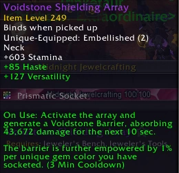
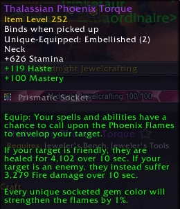

import ITEM from "../../components/ItemLink" 

# Midnight Embellishment Preview: Part I

Midnight season 1 introduces many (15+) new embellishments which add various effects to your crafted gear. As in The War Within, you are capped at wearing two which means you have some interesting decisions to make. You're also very likely to craft a weapon early, regardless of your spec, which means you'll be limited to embellishments that can be attached to the weapon slot. If that one isn't your overall best-in-slot then you'll pivot mid-season. Unfortunately, this is just the reality of the current crafting system.

All embellishments below (and we'll cover about half) are assessed at their current tuning level. It's quite standard for many to be bugged or tuned poorly a few weeks out from launch so the rankings might have switched by the time you are able to craft. Definitely check out your main guide for updated recommendations at that time since this is a preview article only.

## Darkmoon Sigil: Hunt
***Can be attached to: All Weapons & Offhands (NOT Shields). Flexible Secondaries.***

An incredibly unique embellishment that gives you different secondaries based on your physical target. To be clear, this isn't the target of your spells (who will mostly be allies), it is whoever you have clicked and currently have targeted. In a world where mouseovers are a dominant healing strategy this will often be the boss. So, let's see which mob types give which stats. We've started with one of the more complex embellishments so don't worry about them all being this way. There are plenty of typical stat procs too!

| Stat    | Mob Types |
| -------- | ------- |
| Haste  | Elemental / Demon / Aberration    |
| Crit | Beast / Mechanical     |
| Versatility    | Undead / Giant / Undefined Enemies    |
| Mastery    | Humanoid / Dragonkin    |

Notably all allies count as Humanoid and so give Mastery. That offers a safe way to guarantee Mastery for specs that benefit from it. You're also able to have two stats up at once by swapping who you're targeting once a buff is active but that's probably going to be too annoying to really track much. 

#### Current Bugs

The <ITEM>Darkmoon Sigil: Hunt</ITEM> proc rate currently scales with Haste, which is a mistake for stat-based effects. 

**Rating: A+**

This is a great early choice when you're looking for an Embellishment to put on your initial weapon craft.

 

## Loa Worshiper's Band

**Specific Ring only. Always Crit / Mastery**

<ITEM>Loa Worshiper's Band</ITEM> is the second most unique embellishment but it sadly only procs off damage spells. This is no problem if you're playing Disc Priest or Keeper of the Grove Resto Druid but it can be more difficult to get a full proc rate out of on some other specs - particularly in raid. The tooltip isn't very helpful so here's what the ring does:

There are five possible procs, based on which gem types you have equipped. Your proc rate is divided by the number of Loa you can call, so there's no inherent advantage 
to socketing many gem types. If you have the listed gem, then the proc is added to the pool. If you have no gems, it will always proc Filo. If you have all Haste gems, then you'll get
either Filo or Akilzon and so on.

| Loa    | Gem Required | Proc
| -------- | ------- | ------- |
| Filo | Always Available | Intellect Buff
| Nalorakk | Garnet (Crit gem) | Stacking Crit Buff
| Akilzon | Peridot (Haste gem) | Haste & Speed Buff
| Halazzi | Amethyst (Mastery gem) | Damage Proc
| Janali | Lapis (Vers gem) | Damage proc

We don't care as much about the damage procs, so if you were using this you'd probably want to stick to crit and haste gems so as to avoid polluting the pool. Given it's also a Crit
/ Mastery ring I think the pool of specs that'll like using this will be quite slim if not nonexistent. 

**Rating: B+**

Not worth fine-tuning your gems for unless you're in an environment where you really value damage procs. Also a pretty bad proc rate so if you have quite a few gems then you
might be waiting a long time for your chosen proc.

 

## Arcanoweave Lining
**Can be attached to: Any Armor Slot. Flexible Secondaries.**

Finally a nice simple embellishment. Note that while the initial tooltip says it gives stats to yourself and a friend, 80% of the stats are yours and only 20% are shared. Still
a very good embellishment, but less of a support choice than it might initially look. Intellect is also by far your best stat this early into an expansion and you should find the
uptime to be high (about ~55%). It'll give you around 32 intellect and a randomly chosen ally 8 intellect.

**Rating: A**

Just a great choice that can go on any armor slot. Slightly difficult in the early weeks of an expansion though since it cannot go on your early Weapon craft. It could definitely
pop up in the weeks following that if the few above it (<ITEM>Darkmoon Sigil: Hunt</ITEM> for example) are bug fixed.

 
# Voidstone Shielding Array

**Specific Neck only. Always Haste / Versatility**

<ITEM>Voidstone Shielding Array</ITEM> has a very clear audience: high Mythic+ players that require some a button they can push for effective health. A couple of glaring issues however:
- The shield sucks. I have well over 400k health in great gear and it shields for about 10% of my health. 
- The cooldown is extremely long. A 10% shield might be ok if it's up very often but a 3 minute cooldown is terrible. 

The concept is interesting enough, but the tuning is really poor. It is made worse by the bug below:

#### Current Bugs
Healing specs currently get a 33% penalty on the shield portion. These role multipliers are often used on damage effects but it appears one was attached to this too - despite
no part of it being a damage effect (hopefully not a copy / paste issue).

**Rating: D**

Fails to appeal in its niche and the bug makes it worse. Even if buffed unlikely to be the play for the majority of the games audience. 

 

## Thalassian Phoenix Torque
**Specific Neck only. Always Haste / Mastery**

I don't want to be too harsh on Beta-tuning of effects that'll later be rebalanced. It's very common, and it's not a big deal at all - so long as they do get to tuning them
before expansion release. <ITEM>Thalassian Phoenix Torque</ITEM> is an example where they've maybe chosen such a low placeholder as to be obvious it's not final.

You are looking at a 4000 heal effect twice a minute when we have 400,000 health pool. About 10x weaker than expected, but surely set to change before live. Tuning aside,
I don't really see a place where this is a desirable effect unless it's very overtuned. It's a fast ticking HoT but putting out two HoTs a minute just isn't very appealing.

**Rating: D-**

Probably just dead in the water, but we'll see how the final tuning looks.

 
## Sunfire Silk Lining

**Can be attached to: Any Armor Slot. Flexible Secondaries.**

Speaking of barely functional effects, <ITEM>Sunfire Silk Lining</ITEM> is an interesting design where your periodics like heal-over-time effects can proc intellect. It stacks up to 10 times! 
Unfortunately it only procs 5 times a minute and the buff lasts 10 seconds. You will need excellent luck to hit 3 stacks and 10 is outright impossible. I really have no idea what
the intended design is here even but given you'll sit at 0-2 stacks most of the fight it's incredibly poor and increasing the number on it isn't really sufficient. 

I do wonder if it would be better placed as an updated version of <ITEM>Eye of the Broodmother</ITEM> where full uptime on 10 stacks is expected and it's tuned around that expectation. It would be quite nice
to have an embellishment that offers value at all times given most of the alternatives are different kinds of procs. 

**Rating: D-**

We'll cover the other half of the embellishments in a second article, but here's the running tier list so far:

## Tier List So Far
- A Tier: Darkmoon Sigil: Hunt, Arcanoweave Lining, 
- B Tier: Loa Worshiper's Band
- C Tier: ??
- D tier: Voidstone Shielding Array, Thalassian Phoenix Torque, Sunfire Silk Lining